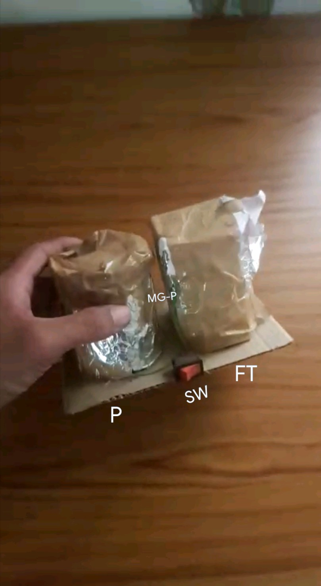

# LAN-Destroyer

Gain full Control of LAN 

This one is Hardware(🙄🙄)

   P  = PowerHouse
   FT = Function Tower 
   SW = Switch

# Installing (Software part)

`cd LAN-Destroyer/V1-gamma`

`sudo chmod 775 Decod`

`./Decod `

# USE (Software Part)

   `sudo LAN-Destroyer `

V1 have only Scanning && kicking && basic flood 
Not have antiIDS 

# Note 

1. here we use Amzx package in V1 only because i am good at my own packages & i get speed up .
V2 will be only shell, not a compiled program 

2. Hardware Making tutorial i will upload soon 
Hardware & software both are independent of each other , 

3.magnetic waves Don't cut each other & also not able to disturb .
So for hardware part i am bit calculatin
This Hardware  I crested 2yr ago & sister broke it 😖. So i again repair now 

4. V1-Gamma is not full version , it Just Test try (like Of you use $You are Testers😁😑)

5. If Your PC Hanged Up||Freeze , Remove AmzDos part or Edit Executor & remove AmzDos fire. 

6. You have 0777 permission for using this repo😌✔ 

       -

